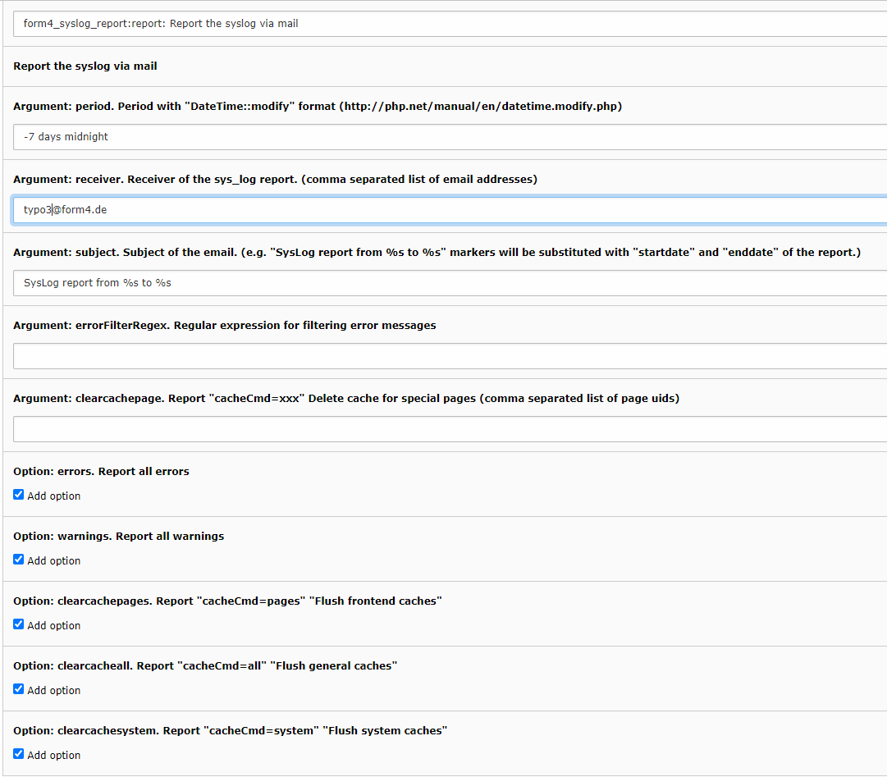

# Administrator manual

Install the extension, then configure a scheduler task or a server cron job.

## Scheduler task

Create a scheduler task of type **Execute console commands (scheduler)** and select the command **form4_syslog_report:report** (label may show as *Form4SyslogReport Report: report*). You can define several tasks with different arguments.



## CLI / cron

From the TYPO3 instance root (adjust the PHP binary if needed):

```bash
php vendor/bin/typo3 form4_syslog_report:report <period> <receiver> [<subject>] [<errorFilterRegex>] [<clearcachepage>] [--errors] [--warnings] [--clearcachepages] [--clearcacheall]
```

| Parameter | Example | Description |
|---|---|---|
| period | `-7 days midnight` | Time window for log entries ([`DateTime::modify`](https://www.php.net/manual/en/datetime.modify.php) format). |
| receiver | `reports@example.com` | Recipient email addresses (comma-separated). |
| subject | `SysLog report from %s to %s` | Email subject; `%s` placeholders are replaced with the report start and end. The site name is prepended. |
| errorFilterRegex | `/exception/i` | Optional regex to filter error lines by message text. |
| clearcachepage | `12,17` | Optional comma-separated page UIDs to include related cache-flush log lines. |
| `--errors` | (flag) | Include error-level log entries (off by default). |
| `--warnings` | (flag) | Include warning-level log entries (off by default). |
| `--clearcachepages` | (flag) | Include “flush frontend caches” actions (off by default). |
| `--clearcacheall` | (flag) | Include “flush all caches” actions (off by default). |
