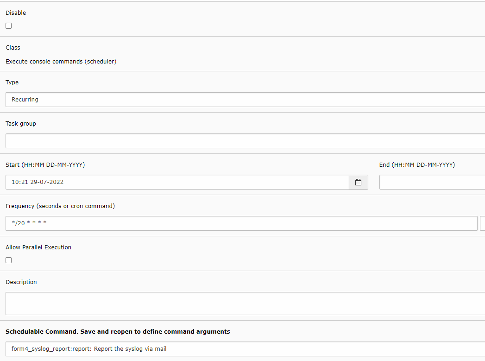
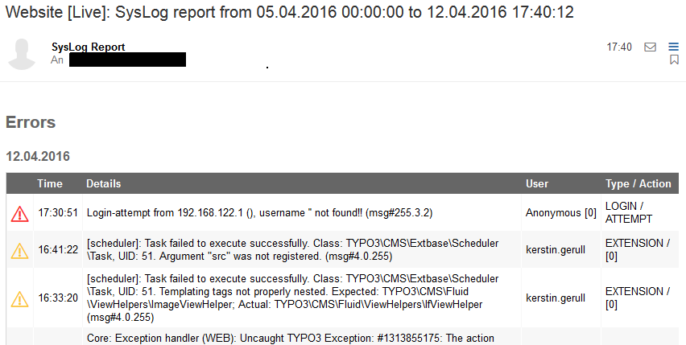

# form4 SysLog Report

## Introduction

This TYPO3 extension sends **e-mail reports** for `sys_log` (system log) entries,
using a **scheduler task** or the **CLI**.

| | |
|--|--|
| **Read online** | [docs.typo3.org](https://docs.typo3.org/p/form4/form4-syslog-report/main/en-us/) (once documentation rendering is connected) |
| **TER** | [extensions.typo3.org/extension/form4_syslog_report](https://extensions.typo3.org/extension/form4_syslog_report) |
| **Composer** | `composer require form4/form4-syslog-report` |
| **Repository** | [github.com/form4-team-typo3/form4_syslog_report](https://github.com/form4-team-typo3/form4_syslog_report) |

## Documentation overview

The full manual lives in the `Documentation/` folder and is rendered on
[docs.typo3.org](https://docs.typo3.org/) (start file: `Documentation/Index.md`).

- [User manual](Documentation/UserManual.md)
- [Administrator manual](Documentation/AdminManual.md)
- [Changelog](Documentation/Changelog.md)
- [Breaking changes](Documentation/BreakingChanges.md)
- [Known issues](Documentation/KnownIssues.md)
